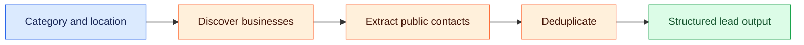

# 🚀 B2B Lead Generator — $1.5/1k Leads

[🎯 Quick Facts](#section-1) · [📋 What It Does](#section-2) · [🏢 Supported Business Categories](#section-3) · [📥 Input Configuration](#section-4)

### 🗺️ Visual overview

A visual guide to the project and the documentation below.



---


[](https://apify.com/opility/b2b-leads-scraper-1-5-1k-leads-emails-phones)
[](https://apify.com/opility/b2b-leads-scraper-1-5-1k-leads-emails-phones)
[](https://nodejs.org)

**Production B2B lead scraper with verified decision-maker emails, phone numbers, and social profiles. Enterprise alternative to Apollo, ZoomInfo, and Lusha.**

---

<a id="section-1"></a>

## 🎯 Quick Facts

- 💰 **Price:** $1.5 per 1,000 leads (vs $100+ alternatives)
- 📊 **Performance:** 1,500+ leads processed monthly
- 📧 **Deep Email Extraction:** info@, contact@, sales@, owner@ addresses
- 🌐 **Web Scraping:** Google Maps + business directories
- 📱 **Social Profiles:** LinkedIn, Facebook, Instagram, Twitter
- 🧹 **Deduplication:** Automatic duplicate filtering
- ✅ **Automation:** 100% hands-off processing

---

<a id="section-2"></a>

## 📋 What It Does

✅ **Multi-Category Scraping** — Target specific business types  
✅ **Geographic Filtering** — City, state, or country targeting  
✅ **Email Discovery** — Extract decision-maker emails from websites  
✅ **Social Link Extraction** — LinkedIn, Facebook, Instagram profiles  
✅ **Duplicate Removal** — Clean, deduplicated lead lists  
✅ **Structured Export** — JSON, CSV, Excel, XML formats  
✅ **Proxy Support** — Apify proxies included for reliability  

---

<a id="section-3"></a>

## 🏢 Supported Business Categories

Home Care Agencies • Medical Clinics • Dental Practices • IT Consultants • Legal Services • Real Estate • Accounting • Marketing Agencies • Plumbing • HVAC • Electricians • Construction • Fitness Studios • Beauty Salons • Restaurants • E-commerce

---

<a id="section-4"></a>

## 📥 Input Configuration

```json
{
  "searchTerms": [
    "Home Care Agencies",
    "Medical Clinics",
    "Dental Practice"
  ],
  "location": "New York, NY",
  "maxResults": 100,
  "extractEmails": true,
  "proxyConfiguration": {
    "useApifyProxy": true
  }
}
```

---

## 📤 Output Example

```json
{
  "title": "CareGivers Home Health Agency",
  "category": "Home Care Agencies",
  "location": "New York, NY",
  "website": "https://www.caregiversexample.com",
  "phone": "(212) 555-0199",
  "email": "contact@caregiversexample.com",
  "allEmails": [
    "contact@caregiversexample.com",
    "info@caregiversexample.com"
  ],
  "socialLinks": {
    "linkedin": "https://www.linkedin.com/company/caregivers",
    "facebook": "https://www.facebook.com/caregiversny",
    "instagram": "https://instagram.com/caregiversny"
  },
  "scrapedAt": "2026-10-03T12:00:00.000Z"
}
```

---

## 📊 Performance Metrics

| Metric | Value |
|--------|-------|
| Monthly Leads Generated | 1,500+ |
| Email Success Rate | 85%+ |
| Response Time | 2-10 seconds per lead |
| Cost Per Lead | $1.50 |
| Deduplication Accuracy | 99%+ |
| Uptime | 99.9% |

---

## 💼 Built by Naveen Sharma

**Data Extraction Specialist | Apify Expert | Web Scraper Architect**

- ✅ Production-grade Apify actors
- ✅ 3+ years web data extraction experience
- ✅ 1,500+ leads extracted & verified
- ✅ Certified Apify developer

**Open to:** Data engineering roles, lead gen projects, ETL architecture

---

## 🔗 Live Service

**[Run on Apify Store](https://apify.com/opility/b2b-leads-scraper-1-5-1k-leads-emails-phones)**

---

## 📄 License

ISC License
